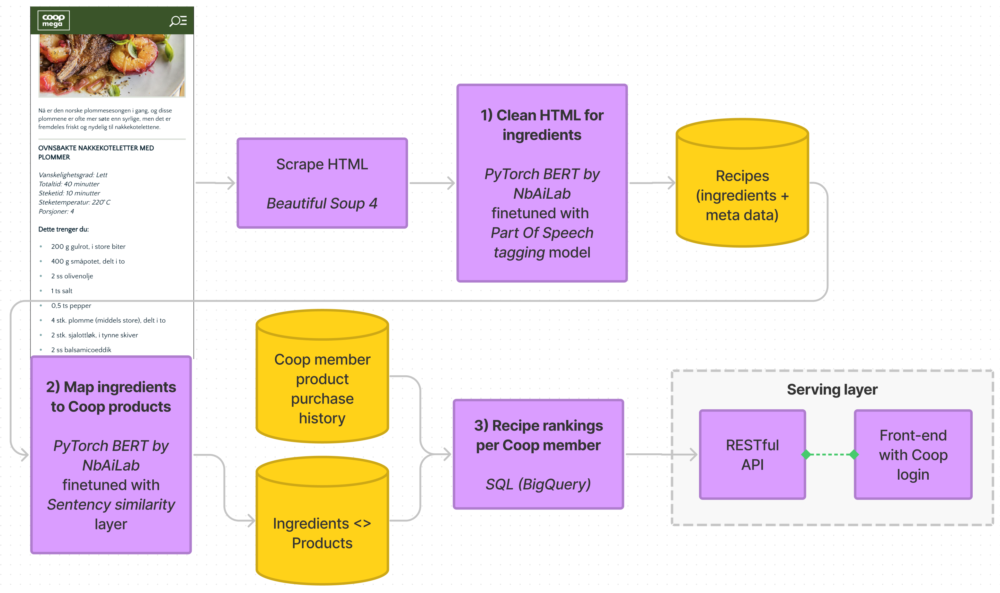

## BERT and NLP for cleaning and mapping data

---

## Contents

- A brief intro to NLP
- `Dinner Blackout` business case
- **Part 1**: Clean HTML for ingredients and metadata
- **Part 2**: Map ingredients to Coop's products
- **Part 3**: Recipe rankings per Coop member

---

## Notes to self

- Use one or more notebooks to show code examples
  - Can I reuse anything, or should I make something from scratch?
- A brief history of NLP
  - Q: how does this fit with the syllabus? ANS: that's the topic of the lecture next week. Could we make this a segway?
- 

---

## A brief intro to NLP

- NLP prior to Deep Learning
- BERT - what is it?
- Huggingface - a revolution?
  - Deep learning in industry = transfer learning / finetuning?

--

Something NLP

---

## `Dinner Blackout` business case

--

Something Dinner Blackout

Probably don't need many slides here. Possibly just 1, max 3.

---

<!-- .slide: data-fullscreen -->

---

# Part 1

## Clean HTML for ingredients and metadata

**Data**: Scraped [Coop recipes](https://coop.no/mega/oppskrifter/)

**Tools**:

- [BERT pretrained on Norwegian by NbAiLab](https://github.com/NBAiLab/notram)
- [Huggingface PyTorch model](https://huggingface.co/NbAiLab/nb-bert-base)
- [BERT finetuned on NbAiLab/norne for POS tagging](https://colab.research.google.com/gist/peregilk/6f5efea432e88199f5d68a150cef237f/-nbailab-finetuning-and-evaluating-a-bert-model-for-ner-and-pos.ipynb)

--

Something part 1

---

# Part 2

## Map ingredients to Coop's products

**Data**: Recipe ingredients (from Part 1)

**Tools**:

- [BERT pretrained on Norwegian by NbAiLab](https://github.com/NBAiLab/notram)
- [BERT finetuned with sentence-transformers layer](https://huggingface.co/sentence-transformers)
  - [Blog post](https://towardsdatascience.com/bert-for-measuring-text-similarity-eec91c6bf9e1)
- [python-string-similarity library](https://github.com/luozhouyang/python-string-similarity)

--

Something part 2

---

# Part 3

## Recipe rankings per Coop member

**Data**:

- Ingredients <> Products mapping (from Part 2)
- Coop member product purchase history

**Tools**: SQL (BigQuery)

--

Something part 3

---

# Conclusion

- a
- b
- c

---

# Questions?

