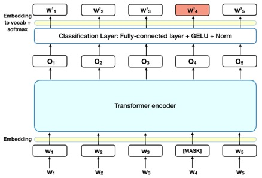

## BERT and NLP for cleaning and mapping data

---

## Contents

- A brief intro to NLP
- `Dinner Blackout` business case
- **Part 1**: Clean HTML for ingredients and metadata
- **Part 2**: Map ingredients to Coop's products
- **Part 3**: Recipe rankings per Coop member

---

## Rasmus Nikolai Nes

Data Scientist @ Coop

MSc Energy & Environmental Engineering, NTNU

Experience from Nordea and Schibsted prior to Coop.

_Disclaimer_: I am not an expert on any of the things I will present here today. The goal is to show an example of a Data Science project in real business setting with real data.

---

## A brief intro to NLP

- NLP prior to Deep Learning
- BERT - what is it?
- Huggingface - a revolution?
  - Deep learning in industry = transfer learning / finetuning?

--

## Natural Language Processing

> The goal is a computer capable of "understanding" the contents of documents, including the contextual nuances of the language within them.

[Wikipedia](https://en.wikipedia.org/wiki/Natural_language_processing)

--

## NLP history

- Symbolic NLP (1950s -- early 1990s)
  - Rule based
- Statistical NLP (1990s -- 2010s)
  - Web size data
  - Unsupervised and (semi-)supervised learning
  - **"Understanding" text still way off**
- Neural NLP (present)
  - Vast data and compute
  - Deep learning architectures
  - Current state of the art: transformer architectures
  - **"Understanding" text is getting closer**

--

## BERT

- _Bidirectional Encoder Representations from **Transformers**_
- Developed by Google in 2018
- Has quickly become a baseline for NLP experiments
- [_The National Library of Norway_][1] published a pre-trained **Norwegian** BERT model
  - Trained on the _Colossal Norwegian Corpus_ (109GB)
  - Well suited for fine-tuning for specific NLP tasks
  - Easily available via [Hugging Face][2]

[1]: https://arxiv.org/abs/2104.09617
[2]: https://huggingface.co/NbAiLab/nb-bert-base

--

### BERT/Hugging Face transfer learning

Easy to fine-tune BERT for different NLP tasks, like:
- Sentiment analysis
- Named Entity Recognition
- Next word prediction
- Next sentence prediction
- **Part-of-Speech tagging**
- **Sentence similarity**

---

### `Dinner Blackout` business case

==Do you know what to make for dinner this evening?==

We think many of us don't - and we want to see if we can do anything to help you with that.

**`Dinner Blackout`**: can we use Coop members' purchase history to make it easier and quicker for them to find a relevant recipe?

--

## Product considerations

What is the main objective of the `Dinner Blackout` project?

**Not**: the algorithm ranking recipes (per member). 

**Rather**: a **product** making it easier for our members to find a relevant recipe. 

<aside class="notes">show app</aside> 

---

<!-- .slide: data-background="images/db_flow.png" -->

---

# Part 1

## Clean HTML for ingredients and metadata

**Data**: Scraped [Coop recipes](https://coop.no/mega/oppskrifter/) 

**Tools**:

- [BERT pretrained on Norwegian by NbAiLab](https://github.com/NBAiLab/notram)
- [Huggingface PyTorch model](https://huggingface.co/NbAiLab/nb-bert-base)
- [BERT finetuned on NbAiLab/norne for POS tagging](https://colab.research.google.com/gist/peregilk/6f5efea432e88199f5d68a150cef237f/-nbailab-finetuning-and-evaluating-a-bert-model-for-ner-and-pos.ipynb)

--

<!-- .slide: data-background="images/db_flow_1.png" -->

--

## Fine-tuning

- Fine-tuning = transfer learning
- Essentially: 
  - take a pretrained neural network model (Norwegian BERT in this case)
  - add/replace some layers for the specific task at hand
  - train model with new layers (and labels)

--

## Example recipe

<!-- .slide: data-fullscreen -->

[RØD CURRY MED KYLLING](https://coop.no/mega/oppskrifter/kylling/rod-curry-med-kylling/)

|**Ingredients list**|Clean A|Clean B|Clean C
|-----|:-----:|:-----:|:-----:
|350 g kyllinglårfilet| kylling| kyllinglår| kyllingfilet
|150 g gresskar| gresskar| | 
|120 g grønne bønner| bønner| grønne bønner| 
|4 dl jasminris| ris| jasminris| 
|1 ss nøytral olje| olje| nøytral olje| 
|4 ss rød curry paste| curry| rød curry paste| curry paste
|2 1/2 dl kyllingbuljong| buljong| kyllingbuljong| kylling
|4 dl lett kokosmelk| kokosmelk| lett kokosmelk| 
|1 lime - revet skall av| lime| limeskall| revet skall av lime
|2 ts fiskesaus| fiskesaus| fisk| saus
|Koriander| koriander| | 
|Rød chili - finhakket| chili| rød chili| 
|1 lime i båter| lime| |

--

## POS tagging

<!-- .slide: data-fullscreen -->

- Transfer learning _on top_ of the pretrained BERT model

- Identifies word types, e.g. _noun_, _adjective_, _pronoun_, etc.

- For the recipes, we're interested in **nouns**.

### In this specific case:

- Need to remove stopwords (`ts`, `dl`, etc.)
- Plenty of `regex` as well...

--

## Example of results

<!-- .slide: data-fullscreen -->

[RØD CURRY MED KYLLING](https://coop.no/mega/oppskrifter/kylling/rod-curry-med-kylling/)

|**Ingredients list**|Clean A|Clean B|Clean C
|-----|:-----:|:-----:|:-----:
|350 g kyllinglårfilet| kylling| kyllinglår| kyllingfilet
|150 g gresskar| gresskar| | 
|120 g grønne bønner| bønner| grønne bønner| 
|4 dl jasminris| ris| jasminris| 
|1 ss nøytral olje| olje| nøytral olje| 
|4 ss rød curry paste| curry| rød curry paste| curry paste
|2 1/2 dl kyllingbuljong| buljong| kyllingbuljong| kylling
|4 dl lett kokosmelk| kokosmelk| lett kokosmelk| 
|1 lime - revet skall av| lime| limeskall| revet skall av lime
|2 ts fiskesaus| fiskesaus| fisk| saus
|Koriander| koriander| | 
|Rød chili - finhakket| chili| rød chili| 
|1 lime i båter| lime| |

**Results in:**

---

# Part 2

## Map ingredients to Coop's products

**Data**: Recipe ingredients (from Part 1)

**Tools**:

- [BERT pretrained on Norwegian by NbAiLab](https://github.com/NBAiLab/notram)
- [BERT finetuned with sentence-transformers layer](https://huggingface.co/sentence-transformers)
  - [Blog post](https://towardsdatascience.com/bert-for-measuring-text-similarity-eec91c6bf9e1)
- [python-string-similarity library](https://github.com/luozhouyang/python-string-similarity)

--

<!-- .slide: data-background="images/db_flow_2.png" -->

--

Contents:

- Fine-tuning 2 - a leap in Deep Learning productivity
- String similarity
  - Character-based vs vector space (read blog post again)
- Show examples from notebook? Probably, it will be more concrete if they can see some examples from it
  - Show inputs and example input
- This is a difficult problem
  - What is similarity in this case? Taste, perhaps?

---

# Part 3

## Recipe rankings per Coop member

**Data**:

- Ingredients <> Products mapping (from Part 2)
- Coop member product purchase history

**Tools**: SQL (BigQuery)

--

<!-- .slide: data-background="images/db_flow_3.png" -->

--

Contents:

- Idea: based on your purchase history, can improve ranking of recipes?
  - Have more than 400 recipes.
- Not a "traditional" supervised learning problem
  - We don't have any labels
- Showcase the draft app?
  - Product considerations

---

# Discussion

- Data cleaning: ML-based vs human

---

# Conclusion

- Think about your data product.
  - Does it need any "fancy" data science?
- Cleaning and mapping data can also benefit from ML
- c

---

# Questions?

